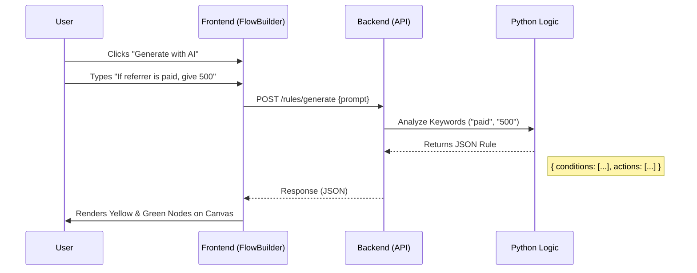
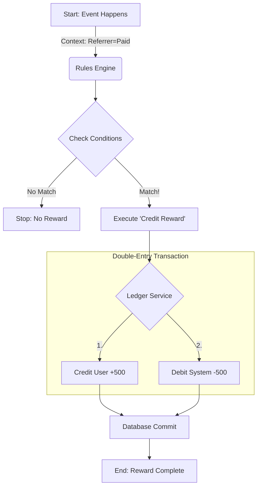

# Referral Ledger & Flow Builder System

A robust, dual-component system for managing referral programs, featuring a **double-entry financial ledger** and an **AI-powered visual rule builder**.

## 🏗 System Architecture

The project consists of two main subsystems:

1.  **Financial Ledger System (The "Bank")**: An immutable, double-entry ledger for tracking rewards.
2.  **Rule-Based Flow Builder (The "Brain")**: A visual tool to define complex referral logic.

### 1. Financial Ledger Architecture
The core requirement is to prevent money from disappearing or being double-counted.

*   **Double-Entry Accounting**:
    *   Every transaction creates at least two ledger entries:
        *   **Credit**: Increases the User's balance.
        *   **Debit**: Decreases the System's liability (System Rewards Pool).
    *   Invariant: `Sum(User Assets) + Sum(System Liabilities) = 0`.
*   **Immutability**:
    *   Ledger entries are **never** updated or deleted.
    *   Corrections are handled via **Reversal Transactions** (creating new offsetting entries).
*   **Idempotency**:
    *   Every request requires a `reference_id`. Duplicate requests are detected and ignored, preventing accidental double-payouts.
*   **ACID Compliance**:
    *   SQLAlchemy sessions ensure that Transaction records, Ledger Entries, and Balance updates are committed atomically.

### 2. Rule Engine Architecture
Allows non-technical users to define logic like *"If referrer is paid and referred user subscribes, give 500"* without code.

*   **Visual Logic Builder**:
    *   Frontend built with **React Flow**.
    *   Users drag "Condition" (Yellow) and "Action" (Green) nodes.
*   **Abstract Syntax Tree (AST)**:
    *   The visual graph is compiled into a JSON AST for the backend.
    *   Example:
        ```json
        {
          "operator": "AND",
          "conditions": [
            { "field": "referrer.status", "operator": "eq", "value": "paid" },
            { "field": "referred.action", "operator": "eq", "value": "subscribes" }
          ],
          "actions": [ { "action_type": "credit_reward", "params": { "amount": 500 } } ]
        }
        ```
*   **AI Generation**:
    *   Includes a Natural Language to Rule generator (Mock implementation) that understands prompts and builds the node graph automatically.

### 🔄 System Flow Charts

#### 1. How the "AI Generation" Works (When you type a rule)

This flow explains what happens when you click "Generate with AI", type a prompt like *"If referrer is paid..."*, and hit Enter.



#### 2. How the "Reward Execution" Works (The Logic Engine)

This shows how a user event travels through the system to become money in the ledger.



---

## 🛠 Project Structure

```
Referral Ledger System/
├── backend/                  # Python/FastAPI Backend
│   ├── main.py               # API Endpoints (Ledger + Rules)
│   ├── ledger_service.py     # Core Financial Logic (Immutable Ledger)
│   ├── rules_engine.py       # JSON Rule Evaluator
│   ├── models.py             # SQL Database Models
│   └── schemas.py            # Pydantic Data Schemas
├── frontend/                 # React/Vite Frontend
│   ├── src/
│   │   ├── FlowBuilder.jsx   # Main Visual Editor Component
│   │   └── index.css         # Tailwind-like styling
│   └── package.json
└── README.md                 # This file
```

---

## 🚀 Getting Started

### Prerequisites
- Python 3.8+
- Node.js 16+

### 1. Start the Backend
The backend runs on port `8000` and uses an SQLite database `referral_ledger.db`.

```bash
cd backend
pip install -r requirements.txt
python -m uvicorn main:app --reload
```
*   API Docs: `http://localhost:8000/docs`

### 2. Start the Frontend
The frontend runs on port `5173`.

```bash
cd frontend
npm install
npm run dev
```
*   Open `http://localhost:5173` to use the Flow Builder.

---

## 💡 Features Guide

### Creating a Flow
1.  **Drag & Drop**: Pull "Condition" nodes to check status (e.g., `referrer.status = paid`).
2.  **Connect**: Link the Condition to an "Action" node (e.g., `Credit Reward: 500`).
3.  **Test**: Click "Test w/ Mock Data" to simulate a user flowing through your rule.
4.  **AI Gen**: Click "✨ Generate with AI" and type a rule description to auto-build it.

### Managing the Ledger
*   **Credit Reward**: `POST /transaction/credit` with a unique `reference_id`.
*   **Reverse Reward**: `POST /transaction/reverse` with the original `reference_id`.
*   **Audit**: Check the `ledger_entries` table to see the full movement history.
